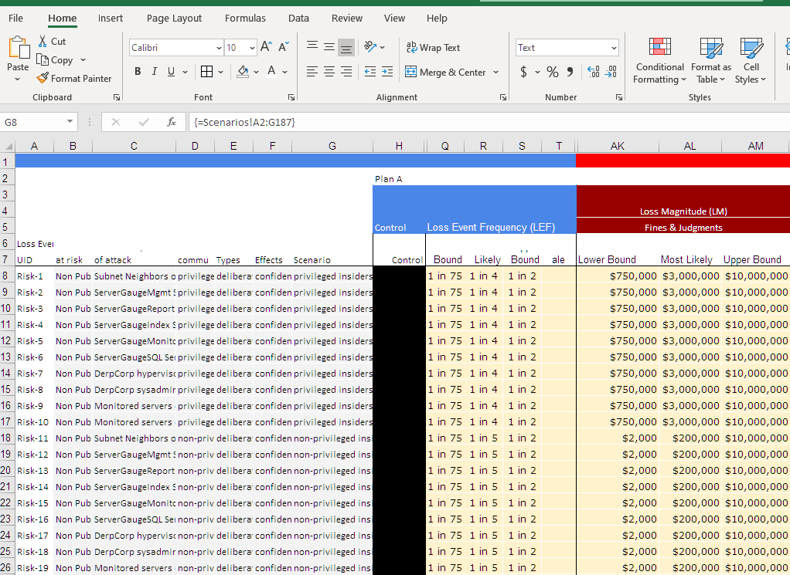
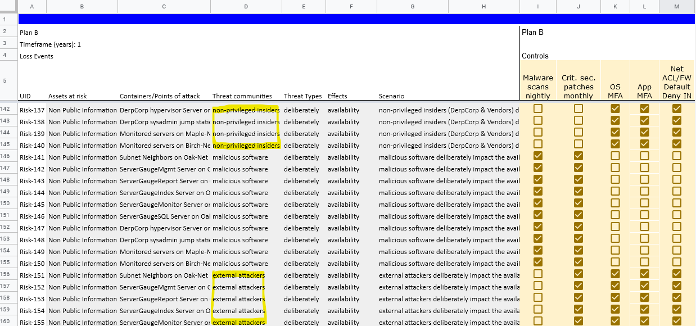

Author: Corey Neskey, CISSP | cneskey@protonmail.com | https://github.com/cneskey | https://linkedin.com/in/cneskey | @cneskey

```{r resources, include=FALSE}
source("src/main.r", echo = TRUE)

# If having Pandoc errors you may need to create a file that explicitly tells R where to launch from. This will happen if you have a weird install or are using a virtual workstation etc.
# Sys.getenv('R_USER')
# .Renviron file in H:/ and included in it the single entry R_USER=H:/
```

Sidebar {.sidebar}
======================================================================
### `r gCommentaryF$Title`

`r gCommentaryF$Authors`

`r gCommentaryF$Date`


### **Exective Summary**

### **Recommendation**
`r gCommentaryF$Recommendation`

### **Next Steps** 
`r gCommentaryF$'Next Steps'`

Analysis {.storyboard}
=====================================

### **Overview** {data-commentary-width=650}

```{r ECDF_plot}
# Inverse Empirical Cumulative Distribution Function (ECDF)
derp <- loss_ecdf_2
derp[3] <- formattable(mutate_all(derp[3], currency, digits=0))
derp[4] <- formattable(mutate_all(derp[4], percent, digits=0))
derp$`probability of exceeding` <- 1-derp$ecdf

ecdf_gg <- ggplot(derp,  mapping = aes(x = loss, y = `probability of exceeding`, colour = plan)) +
  geom_line()+
  labs(
    title="Simulated Loss Output",
    x = "Loss amount",
    y = "Probability of exceeding amount")+
  scale_x_continuous(labels = dollar_format())+
  scale_y_continuous(labels = percent_format())+
  scale_fill_viridis(discrete=TRUE)+
  scale_color_viridis(discrete=TRUE)

ggplotly(ecdf_gg)
```

***

```{r box_plot1}
# # Box Plot
boxplot_gg <- ggplot(data = df.m, aes(x=plan, y=loss)) +
  geom_boxplot(outlier.colour = "black", outlier.shape = 1,
               color=c("#4b0082","lightseagreen","gold")) +
  labs(
    title="Simulated Loss Output",
    subtitle = "Over a 12 month period",
    x = "Control Scenarios",
    y = "Loss") +
  scale_y_continuous(labels = dollar_format()) +
  expand_limits(y = c(0,df.m$loss+(df.m$loss*.05)))

ggplotly(boxplot_gg)
```

### **Scope** {data-commentary-width=200}

```{r scope_table2}
options(knitr.kable.NA = '')
kable(gScope, format = "html", caption = "Scope Table") %>%
  kable_styling(bootstrap_options = "striped",
                full_width = F) %>%
  add_header_above(c(
    "Assets at risk"	= 2,
    "Containers/Points of attack"= 2,
    "Threat communities"= 2,
    "Threat Types"= 2,
    "Effects"= 2
  ))
```
***
`r gCommentaryF$Scope`

### **Projection**  The net value after factoring in costs, benefits, losses, and mitigation costs over 1 year, 2 year, and 3 years. {data-commentary-width=600}

**Plan A Expected**

```{r plan_a_expected}
a_exp <- formattable(mutate_all(Plan_A_Expected,dollar))
row.names(a_exp) <- row.names(Plan_A_Expected)
a_exp
```

**Plan B Expected**

```{r plan_b_expected}
b_exp <- formattable(mutate_all(Plan_B_Expected,dollar))
row.names(b_exp) <- row.names(Plan_B_Expected)
b_exp
```

**Plan C Expected**

```{r plan_c_expected}
c_exp <- formattable(mutate_all(Plan_C_Expected,dollar))
row.names(c_exp) <- row.names(Plan_C_Expected)
c_exp
```

***

```{r line_plot}
line_gg <- ggplot() +
  geom_line(data=Netsm, aes(x=Year,y=Net,group=Plan,colour=Plan))+
  geom_point(data=Netsm, aes(x=Year,y=Net,colour=Plan))+
  geom_hline(yintercept = 0, linetype = 2)+
  labs(
    title="Expected Net Value",
    subtitle = "Benefits minus Costs, Losses, Mitigation Costs, and Prevented Losses)",
    y = "Net Value")+
  scale_y_continuous(labels = dollar)+
 scale_fill_viridis(discrete=TRUE)+
  scale_color_viridis(discrete=TRUE)
ggplotly(line_gg)
```
***

`r gCommentaryF$Projection`

### **Benefits**  Parameters provided by experts to approximate benefits of this project {data-commentary-width=200}

```{r benefits_table}
options(knitr.kable.NA = '')
derp <- gEstimates2[,1:8]
derp[,4:6] <- formattable(mutate_all(derp[,4:6],currency, digits=0,))
derp[,3] <- formattable(mutate_all(derp[,3],percent, digits=0))
kable(derp, format = "html", caption = "Benefits Table") %>%
  kable_styling(bootstrap_options = "striped",
                full_width = F)
```
***
`r gCommentaryF$Benefits`

### **Costs** Parameters provided by experts to approximate the costs of this project. {data-commentary-width=200}

```{r costs_table}
options(knitr.kable.NA = '')
derp <- gEstimates2[,9:15]
derp[,3:5] <- formattable(mutate_all(derp[,3:5],currency, digits=0,))
kable(derp, format = "html", caption = "Costs Table") %>%
  kable_styling(bootstrap_options = "striped",
                full_width = F)
```
***
`r gCommentaryF$Costs`

### Scenarios {data-commentary-width=200}
```{r Scenarios_table}
options(knitr.kable.NA = '')
derp <- gEstimates[,1:7]
kable(derp, format = "html", caption = "Scenarios Table") %>%
  kable_styling(bootstrap_options = "striped",
                full_width = F)
```
***
`r gCommentaryF$Scenarios`

### ECDF {data-commentary-width=200}

```{r ref.label="ECDF_plot"}

```

***
`r gCommentaryF$ECDF`

### Density {data-commentary-width=200}

```{r density_plot}
density_gg <- ggplot(derp, aes(x=loss, color=plan, fill=plan)) +
  geom_density(alpha=0.6) +
  geom_vline(data=mu, aes(xintercept=grp.mean, color=plan),
             linetype="dashed") +
  theme_classic() +
  theme(legend.position="top") +
  labs(
    title="Simulated Loss Output",
    subtitle = "Over a 12 month period",
    x = "Loss",
    y = "Density") +
  scale_x_continuous(labels = dollar_format())+
  scale_fill_viridis(discrete=TRUE)+
  scale_color_viridis(discrete=TRUE)

ggplotly(density_gg)
```

***
`r gCommentaryF$Density`

### Violin {data-commentary-width=200}

```{r violin_plot}
violin_gg <- ggplot(data = df.m, aes(x=plan, y=loss)) +
  geom_violin(aes(fill = factor(plan))) +
  labs(
    title="Simulated Loss Output",
    subtitle = "Over a 12 month period",
    x = "Control Scenarios",
    y = "Loss") +
  scale_y_continuous(labels = dollar_format())+
  scale_fill_viridis(discrete=TRUE)+
  scale_color_viridis(discrete=TRUE)

ggplotly(violin_gg)
```

***
`r gCommentaryF$Violin`

### Swarm {data-commentary-width=200}

```{r swarm_plot}
swarm_gg <- ggplot(data = df.m, aes(x=plan, y=loss,color = factor(plan))) +
  geom_beeswarm()+
  labs(
    title="Simulated Loss Output",
    subtitle = "Over a 12 month period",
    x = "Control Scenarios",
    y = "Loss") +
  scale_y_continuous(labels = dollar_format())+
  scale_fill_viridis(discrete=TRUE)+
  scale_color_viridis(discrete=TRUE)

ggplotly(swarm_gg)
```

***
`r gCommentaryF$Swarm`

### Box {data-commentary-width=200}

```{r box_plot}
hbox_gg <- ggplot(data = df.m, aes(x=plan, y=loss)) +
  geom_boxplot(outlier.colour = "black", outlier.shape = 1, color=c("#4b0082","lightseagreen","gold")) +
  labs(
    title="Simulated Loss Output",
    subtitle = "Over a 12 month period",
    x = "Control Scenarios",
    y = "Loss") +
  scale_y_continuous(labels = dollar_format()) +
  expand_limits(y = c(0,df.m$loss+(df.m$loss*.05))) +
  coord_flip()

ggplotly(hbox_gg)
```

***
`r gCommentaryF$Box`


### Ridge {data-commentary-width=200}

```{r ridge_plot}
ridge_gg <- ggplot(df.m, aes(x=loss, y=plan, fill=plan)) +
  geom_density_ridges(scale = .9, alpha = .8)+
  geom_vline(data=mu, aes(xintercept=grp.mean, color=plan),
             linetype="solid", show.legend = F) +
  labs(
    caption = "Vertical lines are loss means",
    title="Simulated Loss Output",
    subtitle = "Over a 12 month period",
    x = "Loss",
    y = "Density") +
  scale_x_continuous(labels = dollar_format())+
  scale_fill_viridis(discrete=TRUE) +
  scale_color_viridis(discrete=TRUE) +
  theme_ridges(grid = FALSE)

ridge_gg
```

***
`r gCommentaryF$Ridge`


Assessment Methodology
=====================================

**Methodology Criteria**

A risk analysis should meet local, city, state, federal, and international compliance criteria and yield a corresponding risk assessment report. The criteria and objective of this analysis is as follows:  

1. To create a list of threats that the entity may become exposed to as a result of the changes presented in discussion with stakeholders.
2. To communicate the estimated probability and impact of such threats.
3. To create a list of controls/mitigation strategies that may reduce the probability, impact or uncertainty of the listed threats.
4. To communicate the measure of how much the probability, impact or uncertainty of the listed threats is modified by the controls/mitigation strategies considered.
5. To communicate the benefit of controls under consideration and costs associated with them.


**Methodology Standardization & Interoperability**

The taxonomy chosen is based on Open Group's Factor Analysis of Information Risk (FAIR) standard, an open and independent information risk analysis methodology. This ensures transparency, continuity, and interoperability with other major standards.


The Open Group is an industry consortium that facilitates business objectives by developing open, vendor-neutral technology standards and certifications.The Open Group published two Open FAIR standards that form the risk taxonomy followed:


- [Open Risk Taxonomy Technical Standard (O-RT)](http://www.opengroup.org/library/C13K). This standard defines a standard taxonomy of terms, definitions, and relationships used in risk analysis.

- [Open Risk Analysis Technical Standard (O-RA)](http://www.opengroup.org/library/C13G). This standard describes process aspects associated with performing effective risk analysis.


The [FAIR Institute](https://www.fairinstitute.org) maintains publicly available documentation, resources, community events and other modes of promotion, training, and collaboration.


**Deviations from Standard**

The methodology used for this assessment deviates from published standards where those standards deviate from scientifically rigorous literature that meets the following criteria:

- Academic Journal (not trade journals),
- Peer-reviewed,
- Without conflicts of interest by for-profit entities, and
- Without conflicts of interest by political entities.

An annotated review of the scientific literature supporting each component of this methodology may be found [here](https://sites.google.com/view/coreyneskey/improving-cybersecurity-decision-making-by-reducing-expert-bias).


**Methodology**

Scope definition, estimate parameters and commentary are collected using a format comfortable to most users, a spreadsheet. A [companion spreadsheet](https://docs.google.com/spreadsheets/d/1DWB4rdAmUGggkUN0KtVdtyn6E1gZ9j68QifDD8cn2fY/edit?usp=sharing) is provided with this tool which is interoperable with major spreadsheet rendering software such as Microsoft Office Excel and Google Sheets. The only variable that needs to be entered into this tool is the address or filepath to the [companion spreadsheet](https://docs.google.com/spreadsheets/d/1DWB4rdAmUGggkUN0KtVdtyn6E1gZ9j68QifDD8cn2fY/edit?usp=sharing) containing the scope components, estimate parameters, and desired commentary.


*[companion spreadsheet](https://docs.google.com/spreadsheets/d/1DWB4rdAmUGggkUN0KtVdtyn6E1gZ9j68QifDD8cn2fY/edit?usp=sharing) opened in Google Sheets.*




*[companion spreadsheet](https://docs.google.com/spreadsheets/d/1DWB4rdAmUGggkUN0KtVdtyn6E1gZ9j68QifDD8cn2fY/edit?usp=sharing) opened in Microsoft Excel.*


Data is collected in the form of interviews, documentation review, and/or receptor-based discovery scanning in order to define the scope of the assessment. Abstractions of the components within scope are categorized into areas: Assets, Containers / Points of Attack, Agent / Threat Communities, Threat Types, and Threat Effects. 


*NOTICE: Each column is an independent list. i.e. the contents of rows do not relate to each other.*


**Scenario Building**

Loss scenarios are generated by exhausting all combinations of the components identified as in scope. Implausible scenarios are removed e.g. non-malicious malware. Scenario components are strung together to form the respective scenario.


**Parameter Definition**

Probability and impact parameters are defined from the integration of data and [calibrated](https://sites.google.com/view/coreyneskey/improving-cybersecurity-decision-making-by-reducing-expert-bias#h.p_UeVP7PfPc-Qp) subject matter experts for each of the loss scenarios. Predefined distribution parameters and/or hyper-parameters of a loss event are used where they are available and credible.


To take advantage of a person’s natural Bayesian tendencies, [calibration](https://sites.google.com/view/coreyneskey/improving-cybersecurity-decision-making-by-reducing-expert-bias#h.p_UeVP7PfPc-Qp) questions and responses take the form of [frequency formats](https://sites.google.com/view/coreyneskey/improving-cybersecurity-decision-making-by-reducing-expert-bias#h.p_WA7BG-Cgc50Q) instead of percentages or fractions.

[Frequency formats](https://sites.google.com/view/coreyneskey/improving-cybersecurity-decision-making-by-reducing-expert-bias#h.p_WA7BG-Cgc50Q) communicate information to experts in a form that more closely resembles the natural sampling observed in animal foraging and neural networks. What is 1% in standard format would be "10 in 100" in frequency format.


**Control Planning**

This risk assessment tool facilitates the comparison of different combinations of controls that may reduce the probability, impact, or uncertainty of loss events. The tool calls the first theoretical combination of loss events and controls "Plan-A". Plan-A represents the absence of any controls in order to establish a baseline or "inherent risk". Plan-B is the second combination of controls. This is where analysts may list controls that are in place and additional controls that they are considering implementing. Plan C is where the analyst would enter an alternative set or combination of controls which require comparison.


After controls have been entered as column headers under "Controls" the check boxes are used to indicate which loss scenarios that control effects.



*e.g. The "Malware scans nightly" control is an applicable control to the Threat Community entries that contain "malicious software".*


**Simulation**

[Monte Carlo Simulation](https://sites.google.com/view/coreyneskey/improving-cybersecurity-decision-making-by-reducing-expert-bias#h.p_MF82ugY1c50h) is used to generate a dataset using the parameters provided. The simulations consist of at least 10,000 variations of each loss scenario.


**Analysis**

The resulting approximating dataset is then analyzed using appropriate statistical methodologies.


**Reporting / Communication**

Background and scope may be communicated alone or alongside visuals by entering the desired text into the respective sections in the Commentary tab of the spreadsheet.


After analysis has concluded, conclusions and recommendations may also be communicated alone or alongside visuals by entering the desired text into the respective sections of the Commentary tab of the companion spreadsheet.


Col2
-------------------------------------------------------------------------------------

Print Friendly
=====================================

Table of Contents to sections here - Todo []

**Exective Summary**

**Recommendation**

`r gCommentaryF$Recommendation`

**Next Steps** 

`r gCommentaryF$'Next Steps'`

**Overview**

```{r ref.label="ECDF_plot"}
```


```{r ref.label="box_plot1"}
```

***

**Scope**

```{r ref.label="scope_table2"}
```

***

**Analysis**

**Projection**  The net value after factoring in costs, benefits, losses, and mitigation costs over 1 year, 2 year, and 3 years.

```{r ref.label="line_plot"}
```


`r gCommentaryF$Projection`

**Plan A Expected**

```{r ref.label="plan_a_expected"}
```


**Plan B Expected**

```{r ref.label="plan_b_expected"}
```


**Plan C Expected**

```{r ref.label="plan_c_expected"}
```

***

**Benefits**  Parameters provided by experts to approximate benefits of this project

```{r ref.label="benefits_table"}
```

***

**Costs** Parameters provided by experts to approximate the costs of this project.

```{r ref.label="costs_table"}
```

***

Visualizations of the simulated dataset.

```{r ref.label="ECDF_plot"}
```

***

```{r ref.label="density_plot"}
```

***

```{r ref.label="violin_plot"}
```

***

```{r ref.label="swarm_plot"}
```

***

```{r ref.label="box_plot"}
```

***

```{r ref.label="ridge_plot"}
```

***

*Appendix A: Scenarios*
```{r ref.label="Scenarios_table"}
```

***

*Appendix B: Assessment Methodology*

**Methodology Criteria**

A risk analysis should meet local, city, state, federal, and international compliance criteria and yield a corresponding risk assessment report. The criteria and objective of this analysis is as follows:  

1. To create a list of threats that the entity may become exposed to as a result of the changes presented in discussion with stakeholders.
2. To communicate the estimated probability and impact of such threats.
3. To create a list of controls/mitigation strategies that may reduce the probability, impact or uncertainty of the listed threats.
4. To communicate the measure of how much the probability, impact or uncertainty of the listed threats is modified by the controls/mitigation strategies considered.
5. To communicate the benefit of controls under consideration and costs associated with them.


**Methodology Standardization & Interoperability**

The taxonomy chosen is based on Open Group's Factor Analysis of Information Risk (FAIR) standard, an open and independent information risk analysis methodology. This ensures transparency, continuity, and interoperability with other major standards.


The Open Group is an industry consortium that facilitates business objectives by developing open, vendor-neutral technology standards and certifications.The Open Group published two Open FAIR standards that form the risk taxonomy followed:


- [Open Risk Taxonomy Technical Standard (O-RT)](http://www.opengroup.org/library/C13K). This standard defines a standard taxonomy of terms, definitions, and relationships used in risk analysis.

- [Open Risk Analysis Technical Standard (O-RA)](http://www.opengroup.org/library/C13G). This standard describes process aspects associated with performing effective risk analysis.


The [FAIR Institute](https://www.fairinstitute.org) maintains publicly available documentation, resources, community events and other modes of promotion, training, and collaboration.


**Deviations from Standard**

The methodology used for this assessment deviates from published standards where those standards deviate from scientifically rigorous literature that meets the following criteria:

- Academic Journal (not trade journals),
- Peer-reviewed,
- Without conflicts of interest by for-profit entities, and
- Without conflicts of interest by political entities.

An annotated review of the scientific literature supporting each component of this methodology may be found [here](https://sites.google.com/view/coreyneskey/improving-cybersecurity-decision-making-by-reducing-expert-bias).


**Methodology**

Scope definition, estimate parameters and commentary are collected using a format comfortable to most users, a spreadsheet. A [companion spreadsheet](https://docs.google.com/spreadsheets/d/1DWB4rdAmUGggkUN0KtVdtyn6E1gZ9j68QifDD8cn2fY/edit?usp=sharing) is provided with this tool which is interoperable with major spreadsheet rendering software such as Microsoft Office Excel and Google Sheets. The only variable that needs to be entered into this tool is the address or filepath to the [companion spreadsheet](https://docs.google.com/spreadsheets/d/1DWB4rdAmUGggkUN0KtVdtyn6E1gZ9j68QifDD8cn2fY/edit?usp=sharing) containing the scope components, estimate parameters, and desired commentary.

***


*[companion spreadsheet](https://docs.google.com/spreadsheets/d/1DWB4rdAmUGggkUN0KtVdtyn6E1gZ9j68QifDD8cn2fY/edit?usp=sharing) opened in Google Sheets.*

***


*[companion spreadsheet](https://docs.google.com/spreadsheets/d/1DWB4rdAmUGggkUN0KtVdtyn6E1gZ9j68QifDD8cn2fY/edit?usp=sharing) opened in Microsoft Excel.*

***

Data is collected in the form of interviews, documentation review, and/or receptor-based discovery scanning in order to define the scope of the assessment. Abstractions of the components within scope are categorized into areas: Assets, Containers / Points of Attack, Agent / Threat Communities, Threat Types, and Threat Effects. 


*NOTICE: Each column is an independent list. i.e. the contents of rows do not relate to each other.*


**Scenario Building**

Loss scenarios are generated by exhausting all combinations of the components identified as in scope. Implausible scenarios are removed e.g. non-malicious malware. Scenario components are strung together to form the respective scenario.


**Parameter Definition**

Probability and impact parameters are defined from the integration of data and [calibrated](https://sites.google.com/view/coreyneskey/improving-cybersecurity-decision-making-by-reducing-expert-bias#h.p_UeVP7PfPc-Qp) subject matter experts for each of the loss scenarios. Predefined distribution parameters and/or hyper-parameters of a loss event are used where they are available and credible.


To take advantage of a person’s natural Bayesian tendencies, [calibration](https://sites.google.com/view/coreyneskey/improving-cybersecurity-decision-making-by-reducing-expert-bias#h.p_UeVP7PfPc-Qp) questions and responses take the form of [frequency formats](https://sites.google.com/view/coreyneskey/improving-cybersecurity-decision-making-by-reducing-expert-bias#h.p_WA7BG-Cgc50Q) instead of percentages or fractions.

[Frequency formats](https://sites.google.com/view/coreyneskey/improving-cybersecurity-decision-making-by-reducing-expert-bias#h.p_WA7BG-Cgc50Q) communicate information to experts in a form that more closely resembles the natural sampling observed in animal foraging and neural networks. What is 1% in standard format would be "10 in 100" in frequency format.


**Control Planning**

This risk assessment tool facilitates the comparison of different combinations of controls that may reduce the probability, impact, or uncertainty of loss events. The tool calls the first theoretical combination of loss events and controls "Plan-A". Plan-A represents the absence of any controls in order to establish a baseline or "inherent risk". Plan-B is the second combination of controls. This is where analysts may list controls that are in place and additional controls that they are considering implementing. Plan C is where the analyst would enter an alternative set or combination of controls which require comparison.


After controls have been entered as column headers under "Controls" the check boxes are used to indicate which loss scenarios that control effects.


*e.g. The "Malware scans nightly" control is an applicable control to the Threat Community entries that contain "malicious software".*


**Simulation**

[Monte Carlo Simulation](https://sites.google.com/view/coreyneskey/improving-cybersecurity-decision-making-by-reducing-expert-bias#h.p_MF82ugY1c50h) is used to generate a dataset using the parameters provided. The simulations consist of at least 10,000 variations of each loss scenario.


**Analysis**

The resulting approximating dataset is then analyzed using appropriate statistical methodologies.


**Reporting / Communication**

Background and scope may be communicated alone or alongside visuals by entering the desired text into the respective sections in the Commentary tab of the spreadsheet.


After analysis has concluded, conclusions and recommendations may also be communicated alone or alongside visuals by entering the desired text into the respective sections of the Commentary tab of the companion spreadsheet.


Col2
-------------------------------------------------------------------------------------

Legal
=====================================

### **unsuR**
unsuR is a software package that facilitates quantitative risk analysis and reporting.
 
    Copyright (C) 2020  Corey Neskey

    This program is free software: you can redistribute it and/or modify
    it under the terms of the GNU General Public License as published by
    the Free Software Foundation, either version 3 of the License, or
    (at your option) any later version.

    This program is distributed in the hope that it will be useful,
    but WITHOUT ANY WARRANTY; without even the implied warranty of
    MERCHANTABILITY or FITNESS FOR A PARTICULAR PURPOSE.  See the
    GNU General Public License for more details.

    You should have received a copy of the GNU General Public License
    along with this program.  If not, see <https://www.gnu.org/licenses/>.
    
### **LICENSE**

`r sourcetools::read("LICENSE")`
